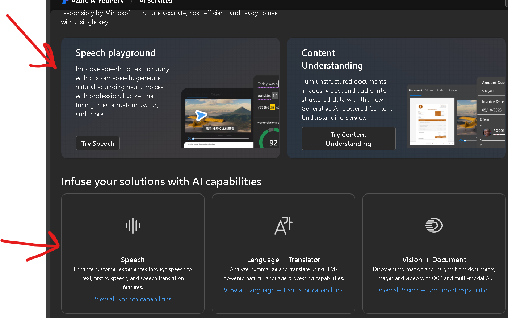
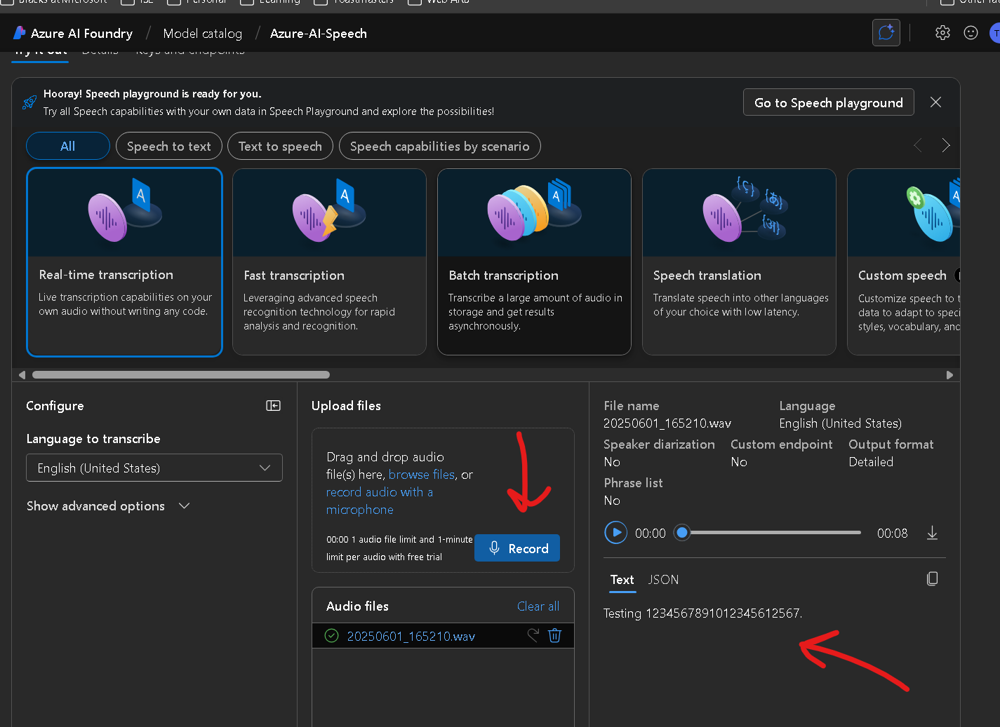

# Exploring Azure AI Foundry: Speech and Text Services

## Summary
We will explore the capabilities of Azure AI Foundry by working with speech and text services. This activity will guide you through using AI Foundry demos aw well as Streamlit applications to convert text to speech and transcribe speech to text, showcasing how AI can enhance communication and accessibility.

## Prerequisites
Before beginning this activity, ensure you have:

1. **Working microphone**: Your device must have a functioning microphone for audio recording
2. **Logged into your Bam Academy account**: You need to log into the account assigned to you by your instructor
3. **Web browser**: Modern browser with JavaScript enabled
4. **Stable internet connection**: Required for accessing Azure AI Foundry demos and applications

## Activity Steps
1. **Access Azure AI Foundry**: Open the Azure AI Foundry in your web browser:

   - Navigate to the [Azure AI Foundry](https://ai.azure.com)
   - Log in with your Bam Academy account credentials
2. **Access AI services**: Locate the AI services section in the Azure AI Foundry:

   - Scroll down to find the `Explore Azure AI Services` button. See the image below for guidance.


3. **Go to the speech playground**: Click either of the `Speech Playground` or `Speech` buttons to access the speech services:

   - This will take you to the speech playground where you can explore various speech capabilities
   - See the image below for guidance on locating the speech playground.


4. **Test real time transcription**: Use the real-time transcription feature:

   - Click on the `Real-time transcription` option
   - Click the Blue record button (middle arrow) to start recording your voice
   - Allow microphone access if prompted
   - Speak clearly into your microphone and observe how your speech is transcribed in real time on the right side of the screen (right arrow)
   - Experiment with different phrases and see how accurately they are transcribed on the right side of the screen. 

   

   Try these tongue twisters for fun:

   ```Peter Piper picked a peck of pickled peppers.
   A peck of pickled peppers Peter Piper picked.
   If Peter Piper picked a peck of pickled peppers,
   Where’s the peck of pickled peppers Peter Piper picked?
   ```
   ```Betty Botter bought some butter
   But she said the butter’s bitter
   If I put it in my batter, it will make my batter bitter
   But a bit of better butter will make my batter better
   So ‘twas better Betty Botter bought a bit of better butter
   ```

   5. **Test Speech Translation**: Use the speech translation feature:

   - Click on the `Speech translation` option

   - Select a language TO the dropdown menu (e.g., Spanish, French) 
   - Click the Blue record button to start recording your voice
   - Allow microphone access if prompted
   - Speak clearly into your microphone and observe how your speech is translated in real time on the right side of the screen
   - Experiment with different phrases and see how accurately they are translated

   


## Reflection Questions

   1. How accurate was the transcription compared to what you actually said?
   2. What factors might affect the accuracy of speech-to-text conversion?
   3. What practical applications can you imagine for this technology?