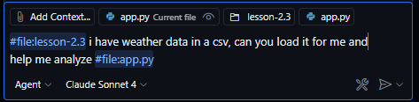
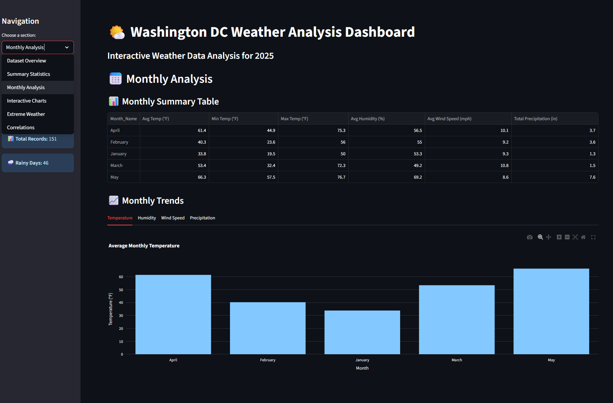

## Activity 1
yeah nice. i was able to do activity 1 so far. is the plan to have them use agent mode in copilot to generate the activity data
like for activity 1 all i did was follow the instructions and did agent mode wtih claude 4 with these inputs 

> Prompt:
> 
> #file:lesson-2.3 i have weather data in a csv, can you load it for me and help me analyze #file:app.py

like this 

and just worked with claude to complete the activity 1:

then afterwards activity 1 it looks like claude even wanted to begin activity 2 by prompting me after activty 1 initial input to clean the data 

## Activity 3
i sorta skipped activity 2. and went to activity 3. i 💗 streamlit. i sorta just jumped to that. and worked in agent mode to run this prompt 

> Prompt:
> 
> Display the different summary statistics using streamlit library, allowing users to scroll through the data

and got these results after it created  a new streamlit `weather_dashboard.py` file and ran `streamlit run weather_dashboard.py` (after i had to install streamlit, plotly and seaboarn.. for some reason copilot had challenges do that)

 

